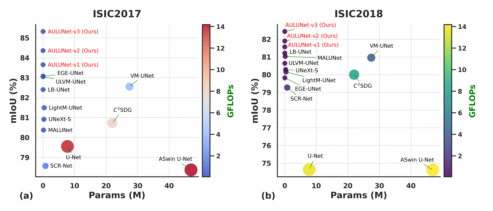

# AULUNet
This is our official code repository for **"AULUNet: An Adaptive Ultra-Lightweight UNet Framework for Efficient Skin Lesion Segmentation in Resource-Constrained Environments"**.
It covers environment setup, installing dependencies, preparing datasets, and training and testing.

---

---

## 1. Environment Setup & Install Dependencies

1. **Create a Conda environment** with Python 3.9:
   ```bash
   conda create -n aulunet python=3.9 -y
   conda activate aulunet
   ```
2. **Upgrade pip** (optional, but recommended):
   ```bash
   pip install --upgrade pip
   ```
3. **Install dependencies** from `requirements.txt`:
   ```bash
   pip install -r requirements.txt
   ```
   > If conflicts occur, recreate or adjust package versions.
4. **Install PyTorch with CUDA 12.2**:
   ```bash
   pip install torch torchvision torchaudio --index-url https://download.pytorch.org/whl/cu121
   ```
   This installs a PyTorch build (e.g., 2.5.1+cu121) compatible with CUDA 12.2.

5. **Verify installation**:
   ```bash
   python -c "import torch; print(torch.__version__); print(torch.cuda.is_available())"
   ```
   - Expected output includes a PyTorch version and `True` for CUDA availability.
   - If `False`, confirm you have correct NVIDIA drivers and CUDA.

---

## 2. Dataset Preparation

Depending on your dataset, you may need additional preprocessing. For certain legacy dependencies (e.g., `scipy==1.2.1`), consider using a separate Python 3.7 environment:

```bash
conda create -n tool python=3.7 -y
conda activate tool
pip install h5py
conda install scipy==1.2.1
pip install pillow
```

### ISIC2017
1. Download from [ISIC 2017 Challenge](https://challenge.isic-archive.com/data).
2. Extract training and ground-truth folders into `/data/ISIC2017/`.
3. Run:
   ```bash
   python prepare_ISIC2017.py
   ```

### ISIC2018
1. Download from [ISIC 2018 Challenge](https://challenge.isic-archive.com/data).
2. Extract training and ground-truth folders into `/data/ISIC2018/`.
3. Run:
   ```bash
   python prepare_ISIC2018.py
   ```

### Custom Dataset
1. Organize files as:
   ```
   ./custom_data/
    ├── images/
    │   ├── xx0.png
    │   ├── xx1.png
    ├── masks/
    │   ├── xx0.png
    │   ├── xx1.png
    ├── prepare_custom_dataset.py
   ```
2. Adjust `prepare_custom_dataset.py` for train, validation, and test split sizes.
3. Run:
   ```bash
   python prepare_custom_dataset.py
   ```

---

## 3. Training and Testing

### 3.1 Training AULUNet

Run the training script:
```bash
python train.py
```
- By default, the training script may **automatically run a test** at the end of each epoch (or at final epochs). If you prefer to run tests separately or later, you can disable that section in `train.py` and use `test.py` whenever desired.
- Outputs (logs, checkpoints, etc.) appear in `./results/`.

> If pretrained weights are needed, ensure you have them referenced in `train.py` or elsewhere.

### 3.2 Testing AULUNet

1. Update the checkpoint path in `test.py` (e.g., `resume_model`) to your trained model.
2. Run:
   ```bash
   python test.py
   ```
3. Outputs will be saved in `./results/`.

---

## 4. Acknowledgements

Thank you to the ISIC 2017/2018 Challenge organizers and open-source community for sharing their repos.

---

Enjoy experimenting with AULUNet! If you encounter any issues, consider opening an issue or discussion in the repository.
